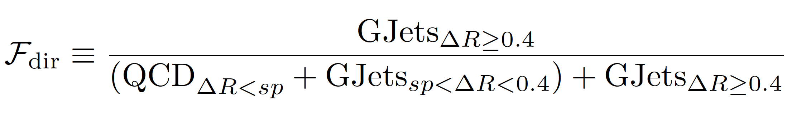

## Code to calculate the photon fragmentation fraction for the RA2/b Zinv estimate. 

 

Further information about the study may be found in AN-2016/350: http://cms.cern.ch/iCMS/analysisadmin/cadilines?line=SUS-16-033

This makes use of the madMinPhotonDeltaR variable, defined in the TreeMaker module here: https://github.com/TreeMaker/TreeMaker/blob/Run2_2017/Utils/src/MinDeltaRDouble.cc

A fragmentation photon is one defined such that dr<0.4. The fragmentation fraction is defined as the the number of photons with dr>0.4 divided by the total number of photons. 

The high statistics GJets_0p4 sample used in the Zinv estimation has a hard cutoff requiring dr>0.4. One needs to account for these events in the MC as any cutoff is artificial and does not match data.

We use the sum of the low statistics GJets, with the hard cutoff requiring dr>0.05, and QCD samples to get the number of photons with dr<0.4. In order to not overcount, a _stitch point_ is defined where QCD is used for values less then the stitch point and GJets is used for values greater than the stitch point. The stitch point value is nominally set to 0.4, but values 0.05 -> 0.4 make perfect sense and can be used for an estimation of the systematic errors associated with this choice.

### Step 1:

To see what is going on with these distributions, plot the madMinPhotonDeltaR for the GJets, GJets_0p4 and QCD HT-binned MC samples:

`root madMinPhotonDeltaR.c+`

This produces Figure 34 of AN-2016/350.

To produce a plot with a wider range, comment/uncomment [lines 44-50](https://github.com/fojensen/photonfragmentation/blob/master/madMinPhotonDeltaR.c#L44-L50) appropriately.

### Step 2:

Make the root file containing the fragmentation histograms:

`root fragmentation.c+`

`fragmentation f`

`f.run()`

Three files need to made for stitch points of 0.2, 0.3, and 0.4 to be used for systematic errors. To do so, comment/uncomment [lines 127-129](https://github.com/fojensen/photonfragmentation/blob/master/fragmentation.c#L127-L129) appropriately.

This code is also able to calculate the fraction the low-deltaphi region used for the QCD estimate. To do so, comment/uncomment [lines 131-137](https://github.com/fojensen/photonfragmentation/blob/master/fragmentation.c#L131-L137) appropriately.

### Step 3:

Plot the fraction for all the analysis bins:

`root fragPlot.c+`

This produces plots of the fragmentation binned in HT, MHT, NJets, and the 46-bin analysis plane.

This produces Figure 35 of AN-2016/350.

### Step 4:

For a systematic error, see how the fraction changes when using a stitch point of 0.2 or 0.3:

`root dfover1mf.c+`

If you want a simpler value to assign for the systematic error, and not bin by bin, we can look at the scatter of the central value of the differences (ignoring the statistical error seen in the bin-by-bin plot):

`root scatter.c+`
